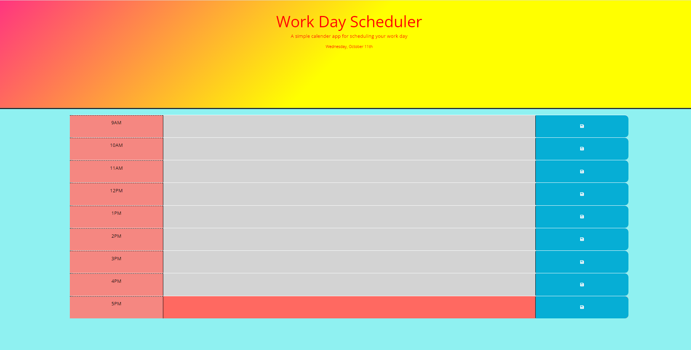

# Third-Party APIs: Work Day Scheduler

## Description

The Daily Planner is a productivity tool designed to help busy employees effectively manage their time by adding and
organizing important events throughout the day. This intuitive web application displays the current day, provides timeblocks
for standard business hours, and color-codes events to indicate whether they are in the past, present, or future. Users can
easily enter, save, and retrieve their daily schedule, ensuring that their important tasks arewell-organized and always at
their fingertips.

## Technologies Used

- HTML
- CSS
- JavaScript
- Web API
- jQuery
- Google Fonts
- Font Awesome
- Bootstrap

## Usage

Screenshot of Work Day Scheduler

## Credits

Followed the tutorials so included the link: https://www.w3schools.com/

## Links

* The URL of the deployed application : https://rudrijoshi.github.io/Workday_Scheduler/

* The URL of the GitHub repository : https://github.com/rudrijoshi/Workday_Scheduler