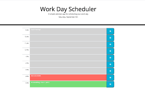

# Third-Party APIs: Work Day Scheduler

## DescriptionThe Daily Planner is a productivity tool designed to help busy employees effectively manage their time by adding and
organizing important events throughout the day. This intuitive web application displays the current day, provides timeblocks
for standard business hours, and color-codes events to indicate whether they are in the past, present, or future. Users can
easily enter, save, and retrieve their daily schedule, ensuring that their important tasks arewell-organized and always at
their fingertips.

## User Story

```md
AS AN employee with a busy schedule
I WANT to add important events to a daily planner
SO THAT I can manage my time effectively
```

## Key Features

```md
Current Day Display: When you open the planner, the current day is prominently displayed at the top of the calendar for quick
reference.

Timeblock Organization: Scroll down to find timeblocks for standard business hours, making it easy to plan your day.

Color-Coded Timeblocks: Each timeblock is color-coded, helping you distinguish between past, present, and future events at a
glance.

Event Entry: Click into a timeblock to enter and edit your events or tasks for that specific time slot.

Local Storage: Clicking the save button for a timeblock saves the event text to local storage, ensuring your schedule persists
even if you refresh the page.
```
## Usage

Screenshot of Work Day Scheduler



## Getting Started

To start using the Daily Planner, simply open the application and begin adding your important events and tasks. The intuitive
interface and color-coded timeblocks make it easy to stay organized and on top of your daily schedule.

## Stay Organized and Productive

With the Daily Planner, you can effectively manage your busy schedule, ensuring that your important events and tasks are well-organized and accessible
whenever you need them. Stay on top of your day and boost your productivity!

## Links

* The URL of the deployed application : https://rudrijoshi.github.io/Workday_Scheduler/

* The URL of the GitHub repository : https://github.com/rudrijoshi/Workday_Scheduler